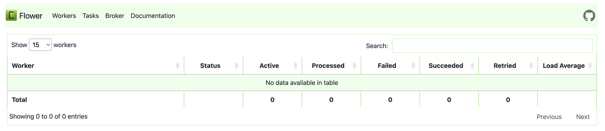

# Installation
https://airflow.apache.org/docs/apache-airflow/stable/howto/docker-compose/index.html
You can run docker with Celery Executor. It's like thread pool in Java 
Celery Executor allows task to be distributed across multiple worker nodes by enabling parallel task execution
it can scale out worker nodes depends on the task load

### Version
docker: 26.0.2
docker-compose: 2.24.6

### memory check
Default amount of memory available for Docker is often not enough to run Airflow up and running. 
Allocate the memory size at lease 4g (ideally 8g)
```shell
docker run --rm "debian:bookworm-slim" bash -c 'numfmt --to iec $(echo $(($(getconf _PHYS_PAGES) * $(getconf PAGE_SIZE))))'
```
- airflow-scheduler
- airflow-webserver
- airflow-worker
- airflow-trigger
- airflow-init
- postgres
- redis
> All these services allow you to run Airflow with CeleryExecutor

### Download docker-compose.yml
```shell
curl -LfO 'https://airflow.apache.org/docs/apache-airflow/2.10.2/docker-compose.yaml'
```
### Flower
- monitoring environment
- http://localhost:5555
```shell
docker compose up flower
```

