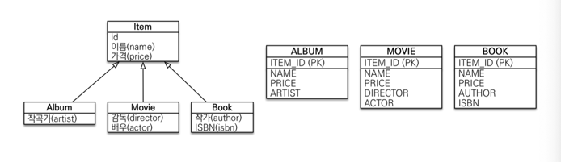

# Persistence Context
- 논리적인 개념
- 여러개의 EntityManager가 Persistence Context에 접근가능하다

## Life Cycle

1. 비영속 (New/Transient)
   - 새로운 상태
   - PC와는 관계없음
   - `new`
2. 영속 (Managed)
   - PC에서 관리되는 상태
   - `persist`, `merge`, `find`
3. 준영속 (Detached)
   - PC에서 관리되다 분리된 상태
   - `detach`, `clear`, `close`
4. 삭제 (Removed)
   - PC에서 삭제된 상태
   - remove
### 장점
1. 1차 캐시: 메모리에 저장된 데이터
2. 동일성 보장: 
3. 트랜잭션을 지원하는 쓰기지원 (Transaction write behind)
4. 변경 감지 (Dirty Checking)
5. 지연 로딩 (Lazy Loading)

# 테이블 연관관계
주 테이블에 외래키가 있는 경우
- 주 테이블이 대상 테이블을 아는 경우
- 장점: 주 테이블만 보고 대상 테이블이 누군지 알 수 있음
- 단점: 대상 테이블에 데이터가 없으면 null

대상 테이블에 외래키가 있는 경우
- 대상 테이블이 주 테이블을 아는 경우
- 장점: 연관관계가 1:1, 1:N으로 바껴도 변동없음
- 단점: 주 테이블은 지연로딩을 통해 대상 테이블을 조회해야 함

# 상속
1. 조인 전략

2. 단일 테이블 전략

3. 구현 클래스마다 테이블 전략

# Proxy
- 실제 클래스를 상속하여 생성
  - em.find(): 데이터베이스로 조회한 실제 엔티티
  - em.getReference(): 가짜 엔티티 (프록시) 조회, 실제 데이터베이스에서 조회하지 않는다 (lazy loading인 경우)
- 실제 객체의 참조를 보관

### 초기화
초기화는 DB에서 데이터를 가져오는 것을 뜻한다

### 특징
- 처음 사용 시, 한번만 초기화
- 초기화되면 프록시 객체는 실제 엔티티에 접근 가능 (프록시가 엔티티로 바뀌는 것은 아님)
- 프록시는 원본 엔티티를 상속받아 생성 (instance of)
- 초기화되면 em.getReference()해도 실제 엔티티 반환
- detach 상태일 때 프록시 초기화 하면 문제 발생: 영속성 컨텍스트에 아무것도 없으니

### 즉시로딩
- 가급적 지연로딩
- 예상치 못한 SQL 발생
- JPQL에서 N+1 문제 발생
- @ManyToOne은 기본이 즉시로딩
- 자주 사용하는 객체끼리는 즉시로딩 고려가능

### cascade
- 특정 엔티티를 영속상태로 만들 때 연관된 엔티티도 영속 상태로 만들고 싶은 경우